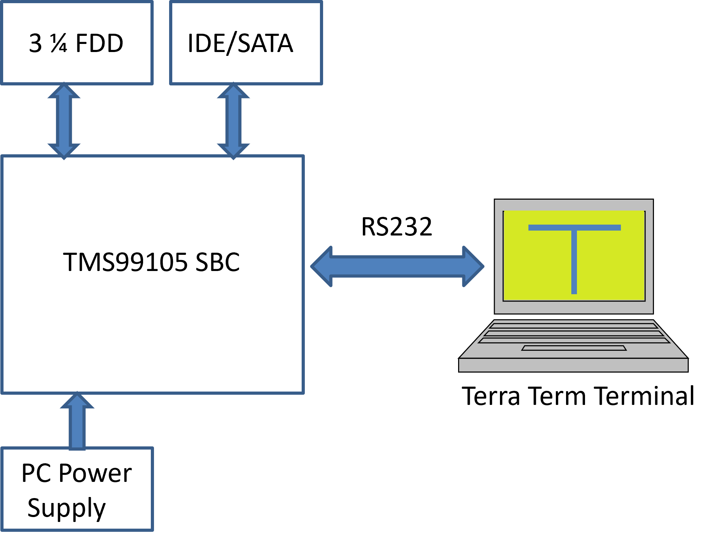

# TMS9900-SBC
## TMS9900/99105A Single Board Computer

### A bit of history
During my time at university I became caught up in the microprocessor revolution but could not afford many of the available 8 bit microprocessor units that were available at the time, such as the MITS 8080 and the SWTP 6800. With the issue of Ron Cain's Small C compiler in an 1980 issue of Dr Dobbs I began thinking of making my own single board S100 based system. I just knew that it had to be 16 bits and it came down to a choice between the Motorola 68000 and the TI 9900. It was the uniqueness of the TMS900 architecture that set me on the path to building a couple of CPU boards around the TMS900 which eventually led to this single board computer. On this site I will share all the circuit diagrams and software that was built during the whole exercise. I believe this should be readily understandable by anyone who has experience in building electronic systems.  The first version of the TMS 9900 was built using S100 bus and enclosure as shown here.

 


### The TMS 99105A Microprocessor Single Board Computer
In the early 1980s an enhanced version of the microprocessor was released. The TMS 99105A was backward-compatible with the TMS9900 but featured an on-board phase clock and multiplexed data bus that reduced the pin out and introduced a degree of additional sophistication in the manner in which the state of the microprocessor could be monitored. The first chip I managed to get access to was a TMX 99105, where the 'X' signifies that the chip was part of an experimental batch which has subsequently been replaced with a full production version. The reduced size of the chip and the integration of the clock and other improvements made it possible to include the chip and a full 64k byte memory capacity and floppy disc controller on a single wire wrap prototype board. This board is shown in the photograph on the left. Texas Instruments TMS 99105 is the third generation of 16-bit microprocessors. The family includes all instructions from the two previous generations, TMS9900 and TMS9995, and fully object-code compatible with them. New instructions included in the TMS 99105 are 32-bit arithmetic and logic, bit test, signed multiply and divide, and stack-related instructions. In addition to these new instructions, it is possible to re-define unused processor opcodes as new instructions. This can be achieved either with the help of an attached processor (i.e. co-processor), or by using a Macrostore feature. The Macrostore allows system designers to map unused microprocessor opcodes to custom functions located in a memory address space, which is separate from main memory. This allows the CPU to access up to 128 KB memory (64 KB of main memory + 64 KB of Macrostore memory). It is also possible to split main memory into two memory segments - 64 KB instruction segment and 64 KB data segment. In this case maximum addressable memory size is increased to 192 KB. The TMS99105 family uses memory-to-memory architecture. The main advantage of this architecture is that the set of CPU registers (called "Workspace") can be located anywhere in memory. This architecture makes saving and restoring of the contents of all CPU registers as simple as switching the base address of the workspace. The disadvantage of this architecture is that the processor speed is highly dependent on memory speed. The 99105 CPUs have external clock frequency 24 MHz, which is divided by four internally. It takes three or more machine cycles for the CPU to execute any instruction when no wait states are required to access the memory. This translates to maximum execution speed 2,000,000 instructions per second or less. Execution speed drops significantly when the processor is used with slow memory - instructions may execute up to two times slower when memory access requires 1 wait-state, or up to 3 times slower when 2 wait-states are required.


### Description of the TMS 99105A Single Board Computer (SBC)
From the circuit diagram of the TMS99105 SBC it should be apparent that the board comprises three primary components, the CPU and its logic, the memory and its controller and lastly the Floppy Disc (FDC) and IDE Interface that supports a Solid State Drive (SSD). The logic on the board was built directly from the data in the TMS99105A Data manual, and the only area that may cause any concern is the logic-reducing 74S188 PROM that is used to decode some of the key internal CPU states that are used during the multiplexing of the address, data and IO states. The coding for the PROM is available here and there are a few links on the internet that show how to build a simple programmer (Today, a GAL would be a better choice).  

The SBC memory is organised in three tiers.   The first is a Common SRAM (that is common to all memory segments), a 64k Word Paged DRAM, and ROM that contains a limited DISC-MONITOR and the XOP and IDE interface software.  The ROM monitor which is essentially a BIOS contains all the IO routines include disc interfaces.  It was originally based on the Jeremy and Alan Jones monitor but modified to allow the loading of HEX images into memory along with some other improvements. This HEX loader is the key to bootstrapping the FDC/IDE controller software and the floppy disc bootstrap routines. The structure of the FDC Monitor was taken, in part, from the BIOS listing that was used in the Fergusson Z80 Big Board II single board computers of the early 80s that used a WD1797 FDC Controller.   The IDE/SATA interface is a common board available on both eBay and Amazon. 

The memory map is shown below:


#### Segmented Memory - Software Support
Accessing the segmented memory is made relatively easy in the TMS99105A with the ability to programme the PSEL output signal using the status register's bit 8.  Whilst the LDD and LDS macro commands can be used to access data in other pages to call subroutines or functions you need to implement a calling routine.  This has been done using XOPs for CALL_FAR and RETF.  These routines can be found in the DISC_MONITOR source code.  

Managing the segments is done through allocating Register R9 as the Segment Register and a call to the XOP function (SETPAGE) which acts in a similar manner to the Memory Mapper (74LS612)  in that sets the  mapping address (contained in R9).  So when PSEL is high (bit 8 low) the normal 15 addresses are presented to the memory controller.  When PSEL signal goes low, in similar manner to the 74LS612 memory mapper, the previously set mapping address is presented to the memory controller.  This is effectivel a single register memory mapper, which just means that each time you want to select a memory segment, that you need to place the value into the upper byte of R9 and the call SETPAGE. .  The segment address register contains 2 bytes.  The upper byte is the page that is in effect, and the lower byte is the page that is base page, in the event a long or far call is made.  The XOP CALL_FAR routine will push the value of the segment register (R9), and return Instruction pointer onto the stack before making the long call. 

Here is an example:
```
;
;================================================
; MAIN IN RUNNING IN SEG 0
; NOTE: R9 IS THE SEGMENT REGISTER.
; UPPER BYTE SETS THE PAGE REGISTER, LOWER BYTE IS CALLING PAGE
;=================================================
	SEG  0
	MESG	@GREETM		;ASSUME DEFAULT IS SEGMENT 0
	LI 	R9,0100H	;FAR CALLS ARE TO SEGMENT 1
	CALL_FAR	@MOD1	;NOTE: CALL_FAR WILL AUTOMATICALLY SET CALLING PAGE
	CALL_FAR	@MOD2	;NOTE: CALL_FAR WILL AUTOMATICALLY SET CALLING PAGE
	LDS
	MOV	@M2STATUS,R1	;STATUS WORD LOCATED IN SEG 1
	WHEX	R1
	B	@MONITOR
;
GREETM:	BYTE	0AH,0DH
	TEXT	'Memory Segmentation Tests...'
	BYTE 	0AH,0DH,0
;
;===================================================
; MODULE 1 RUNNING IN SEG 1
;===================================================
	SEG  1
	AORG	500H		;LOAD ADDRESS
;
; WRITE GREETING TO THE CONSOLE USING DISC-MONITOR
;
MOD1:	MESG	@M1G
	RETF
		
M1G:	TEXT	"Hello from Module 1."
	BYTE	0DH,0AH,0
;
;====================================================
; MODULE 2 RUNNING IN SEG 1
;====================================================
	SEG	1
MOD2:	AORG 	0E800H		;LOAD ADDRESS
;
; WRITE GREETING TO THE CONSOLE USING DISC-MONITOR
;
	MESG	@M2G
	LI	R1,1	;RETURN SUCCESS
	RETF
M2G:	TEXT	"Hello from Module 2."
	BYTE	0DH,0AH,0
``` 

### Terminal Communications Interface
Communications Interface
The board is designed to communicate through a standard DTE/DTA RS232 serial connection to the user terminal which will normally be a PC running a terminal application. This application can then be used to execute commands on the SBC and to download programmes, etc. A typical interface is shown on the left.



Terminal software on the PC can be readily found on the internet and you should chose the one that has the interface you feel most comfortable with. The important requirement is that the terminal programme is able to upload files using raw file and xmodem protocol.

### Typical Terminal Session
A typical Terminal Session is shown below.  On power-up the SBC load the Monitor that provides low level memory inspection facilities etc.   The Quick Boot (Q) instruction will interact with the IDE drive to boot the operating system (BDOS and Shell).  The XMODEM application allows large files to be transferred to the SBC and stored on disc.   In the terminal session you can see that the SIEVE application has been downloaded using XMODEM and executed.


### Installing the MONITOR DISC ROMs
The DISC Monitor can reside in either a 2716 or 2732 (16k or 32k) ROM located at address F000H in the TMS99105's memory space and because the CPU is 16 bit requires that if you use 8bit EPROMs such as the 2716 or 2732 that you split the DEBUG Monitor HEX file into upper and lower bytes. The a99.exe assembler produces INTEL format HEX files for loading into an EPROM burner so that the EPROMs can be programmed. The complete package, including the source, HEX files and the assembler can be downloaded from this site.  

### ROM Memory Map
The programming of the EPROMS can be a little tricky and the following memory map hopefully makes sense of it. As we are using 2732 (32k) EPROMs and because we have our TIMON debugging monitor located at F000H we need to offset the location of code in the EPROMS 0800H. So, if you are using an EPROM burner similar to the Wellon VP-280 (which is what I use) you would load the file odd bytes into the programme's memory specifiying a length of 1000H and a buffer destination location of 0800H, which corresponds to the hex file's location of f000h. Because the HEX file combines the upper and lower bytes you need to specify this when reading the file into the programmer by (for the high bytes) that the files alternate bytes are read.   See the following diagram.

<div>
    
</div>

The method of loading software programmes into memory and executing them is described in the Building the Small OS page.
